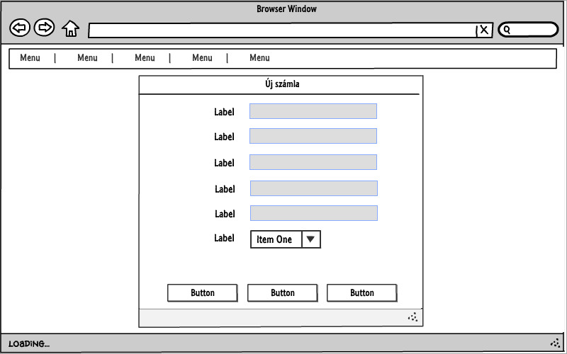

#Online bank alkalmazás

## I. Követelményanalízis
A fent említett alkalmazás célja, hogy mindenki számára elértővé tegye, az online bankolás
főbb szolgáltatásait. Manapság a modern, rohanó életben senkinek nincs kedve bajlódni a papírmunkával,
nem is beszélve eme megoldás környezetre gyakorolt káros hatásaival. Továbbá az emberek bizalmatlanok az online bakszámlaszám megadásával kapcsolatban.
Az nyújtott szolgáltatásaink ezt is megoldják, hiszen ha létrehoz virtuális számlákat, 
akár minden online bolthoz rendelhet egy számlát így csak annyi összeget kell a számlára utalni amennyire éppen szüksége van. 
Ezért alkottuk meg ezt az alkalmazást, amit banktól függetlenűl bárki használhat.
Csak regisztráció és pár egy meglévő bankkártya adatai-ra van szükség a funkciók használatához.
Az ügyfél létrehozhat egy fő számlát ami egy külső bank tulajdona, továbbá több virtuális számlát.
Ezek között jelen esetben átutalásokat végezhet (az online vásárlás a késöbbiekben integrálva lesz az alkalmazásba).

#### Funkcionális elvárások
* **Vendégként**,
    * Szeretnék regisztrálni, hogy ügyfél lehessek. --> Regisztráció
    * Szeretnék bejelentkezni az alkalmazásba. --> Bejelentkezés
* **Ügyfélként**,
    * Szeretnék bejelentkezni az alkalmazásba. --> Bejelentkezés
    * Szeretnék új számlát (fő vagy virtuális) hozzáadni a fiókomhoz. --> Számla hozzáadása
    * Szeretnék a meglévő számláimat kezelni, aktiválni, deaktiválni vagy törölni. --> Számlák kezelése
    * Szeretnék egy már meglévő vagy az össze számla egyenlegét megtekinteni. --> Egyenleg
    * Szeretnék egy vagy az összes számla történetét megtekinteni. --> Számlatörténet
    * Szeretnék számlák között átutalásokat végezni. --> Átutalás
    * Szeretnék az akalmazásból kijelentkezni a feladataim elvégzése után. --> Kijelentkezés
* **Adminként**,
    * Szeretnék minden ügyfelet látni --> Ügyfelek
    * Szeretnék egy adott ügyfelet törölni
    * Szeretnék minden számlát látni --> Számlák
    * Szeretnék minden számlatörténetet látni --> Számlatörténetek

* A funkciók csak bejelentkezett ügyfelek számára elérhetőek, kivéve a regisztráció. 
A belépéshez szükséges adatok adatbázisban tárolódnak, ezek segítségével történik az autentikáció.
A főoldalon esetleg információk jelenhetnek meg az alkalmazással kapcsolatban.

#### Nem funkcionális követelmények
* Felhasználóbarát, modern, letisztult elrendezés és felépítés.
* Gyors működés, a funkciók magas rendelkezésre állása.
* Biztonságos működés: a jelszavak és egyéb számla adatok egy disc alapú adatbázisban tárolódnak.
* Ezekhez az adatokhoz gyorsan és könnyedén férhetünk hozzá a megvalósított funkciók álltal.
* A karbantarthatóságot biztosítja az alaklmazás moduláris felépítése.

### Használatieset-model, funkcionális követelmények

#### Szerepkörök
* **Vendég**: Hozzáférhet a főoldal tartalmához, továbbá a regisztrációs ütlaphoz és a bejelentkezés funkcióhoz
* **Ügyfél**: Teljes körű hozzáférést biztosít a program számára, vehet fel új számlákat, hozzáfér egyenlegükhöz és az ezekhez tartozó számlatörténetekhez. 
Továbbá aktiválhatja illetve deaktiválhatja számláit. Tranzakciókat végezhet el az egyes számlák között
* **Admin**: Törölhet ügyfeleket és számlákat, megtekintheti az összes számla történetét.

#### Használati-eset diagram.

#### Folyamatok.

**1. Regisztráció**

A regisztráció vendégek számára elérhető. A linkre kattintva meg kell adnia a felhasználónak pár rá vonatkozó adatot (e-mail cím, jelszó, lakhely, stb.).
Ha a regisztráció sikertelen az alkalmazás egy hibaüzenetben tájékoztatja a felhasználót a keletkezett problémáról.

**2. Bejelentkezés**

Belépés funkció, mind a három típusú felhasználó számára elérhető. Sikeres bejelentkezéshez a regisztrációnál megadott, megfelelő e-mail cím és jelszó páros szükséges.
A belépés gombra kattintva az alkalmazás ellenőrzi a kapott adatokat, ha hibásak az adatok hiba üzenet formájában tájékoztatja a felhasználót, 
ellenkező esetben a belépés sikeres és a további funkciók elérhetővé válnak.

**3. Számla hozzáadása**

A funkció eléréséhez bejelentkezés szükséges. Ezek után a Számla hozzáadása menüpontra kattintva két opció közül választhat az ügyfél.
Az első a fő számla megadása, ez úgymond egy szülő számlája lesz a többinek, erről tud megfelelő összeget juttatni a virtuális számlákra.
Ennek létrehozásához meg kell adnunk a fő számla számát és a pénznemet, majd a Kész gombra kattintva az alkalmazás hozzárendeli az ügyfél fiókjához a számlát.
Viszont minden ügyfélnek csak egy Fő számlája lehet, ezt persze törölheti és vehet fel újat. Tehát ha a második Fő számláját szeretné hozzáadni az alkalmazás hibaüzenet formájában tájékoztatja,
az ügyfelet, hogy ez nem lehetséges.
Egy másik lehetőség a Virtuális számla hozzáadása a fiókhoz. Itt nem kell megadnunk a számlaszámot, ezt az alkalmazás generálja, a pénznem megadása viszont itt is kötelező.
Szintén a Kész gombra kattintva elkészül az új számla.
Mindkét esetben ha a hozzáadás sikeres volt akor egy üzenet formájában kap tájékoztatást az ügyfél.

**4. Egyenleg lekérdezés**

A funkció eléréséhez bejelentkezés szükséges. Belépés után a Számlák menüből kiválasztandó az Egyenleg menüpont.
Ekkor az ügyfél, ha rendelkezik számlákkal itt tudja megnézni a hozzá tartozó egyenlegeket lista formájában.
A számlaszámra kattintva az adott számlához tartozó adatok jelennek meg.

**5. Számlatörténet megtekintése**

A funkció eléréséhez bejelentkezés szükséges. Belépés után a Számlák menüből kiválasztandó a Számlatörténet menüpont.
Ekkor az ügyfél, ha folytatott tranzakciókat itt tekintheti meg az összes számlájához tartozó történeteket táblázatos formában.
A számlaszámra kattintva az adott számlához tartozó tranzakciók jelennek meg.

**6. Átutalás**

A funkció eléréséhez bejelentkezés szükséges. A felső menüből az Átutalás menüpontra kattintva megjelenik az átutalás űrlap.
A funkcióhoz egyenlőre két saját számla megléte szükséges. Ezeket lehet kiválasztani a legördülő menükből majd megadni az utalás összegét.
Sikeres átutalásnál egy üzenet formályában kap az ügyfél visszajelzést a folyamat végrehajtásáról.
Sikertelen tranzakció esetén a számlák egyenlegei nem változnak, továbbá ez esetben hibaüzenet formájában tájékoztat az alkalmazás.

**7. Adatlap**

A funkció eléréséhez bejelentkezés szükséges. A jobb felső sarokban található menüből választható opció az Adatlap.
Ekkor az ügyfél a saját adatait láthatja amit a regisztráció során megadott. Itt lehetősége van a belépési adatok megváltoztatására.
A Mentés gombra kattintva helyesen kitöltött adatok mellett, egy üzenet jelenik meg a felhasználónak, hogy a változtatás sikeres volt, ellenkező esetben egy hibaüzenetet kap az ügyfél.

**8. Kijelentkezés**

A funkció eléréséhez bejelentkezés szükséges. Miután a tervezett szolgáltatásokat használta az ügyfél, kiléphet az alkalmazásból.
Ezt a jobb felső sarokban látható nevünkre kattintva, a Kilépés menüpontot választva teheti meg. Az alkalmazás egy felugró ablak formájában megerősítést kér.

## II. Tervezés

#### Oldaltérkép
_Publikus:_

* Főoldal
* Regisztráció
* Bejelentkezés

_Ügyfél:_

* Főoldal
* Regisztráció
* Bejelentkezés/Kijelentkezés
* Fő számla hozzáadása
* Virtuális számla hozzáadása
* Számlák kezelése
    * Aktiválás
    * Deaktiválás
    * Törlés
* Számla egyenlegek
    * Kiválasztott számla egyenlege
* Számlatörténetek
    * Kiválasztott számla története
* Átutalás

_Admin_

* Főoldal
* Regisztráció
* Bejelentkezés/Kijelentkezés
* Ügyfelek
    * Ügyfél törlése
* Minden számla
* Minden számlatörténet

#### Végpontok
* GET / : Főoldal
* GET /auth/login : Bejelntkező oldal
* POST /auth/login : Bejelentkezési adatok felküldése
* GET /auth/signup : Regisztrációs oldal
* POST /auth/signup : Regisztrációs adatok felküldése
* GET /account/accounts : Számlák oldal
* GET /account/create : Virtuális számla hozzáadása oldal
* POST /account/create : Virtuális számla adatainak felküldése
* GET /account/addmaster : Fő számla hozzáadása oldal
* POST /account/addmaster : Fő számla adatainak felküldése
* GET /account/delete/:id : Számla törlése
* GET /account/active/:id : Számla aktíválása vagy deaktiválása
* GET /account/balance : Számlák egyenlegei oldal
* GET /account/balance/:id : Számla egyenlege oldal
* GET /history/histories : Számlatörténetek oldal
* GET /history/histories/:sourceaccount : Számlatörténet oldal
* GET /history/delete/:id : Számlatörténet törlése
* GET /account/transfer : Átutalás oldal
* POST /account/transfer : Utalás adatainak felküldése
* GET /user/profile : Ügyfél profilja oldal
* POST /user/changepass/:id : Ügyfél jelszómódosítás adatok felküldése
* GET /admin/signup : Admin létrehozása oldal
* POST /admin/signup : Admin adatok felküldése
* GET /admin/users : Ügyfelek oldal
* GET /admin/accounts : Minden számla oldal
* GET /admin/histories : Minden számlatörténet oldal
* GET /admin/deleteuser/:id : Ügyfél törlése

### Felhasználóifelület-modell (Oldalvázlatok)

**_Regisztráció_**

**_Bejelentkezés_**

**_Számla hozzáadása_**

**_Számlák megtekintése_**

**_Egyenleg lekérdezés_**

**_Számlatörténet megtekintése_**

**_Átutalás_**

**_Adatlap_**

###Osztálymodell

#### Adatmodel

#### Adatbázisterv

#### Állapotdiagram

### Dinamikus működés

Szekvenciadiagram

## III. Implementáció

**Környezet**

Az alkalmazás fejlesztéséhez a [Cloud9](http://c9.io) felhő alapú IDE-ja szolgált.
Ez tulajdonképpen egy virtuális gép, amit böngészőböl el lehet érni, amin egy linux disztribúció fut.
A virtuális gép paraméterei a következők: CPU - 1 mag, RAM - 512 MB, HDD - 1 GB.
A környezet lehetővé teszi az alkalmazás futtatását és tesztelését a fejlesztés során.

**Fejlesztéshez használt nyelv és csomagok**

Az implementáció során a Node.js-t használtuk és ennek különböző csomagjait.
Telepíteni a fent említett csomagokat az `npm install 'csomag neve' --save` parancs kiadásával tudjuk.
Felhasznált csomagok: 

* bcryptjs
* body-parser
* connect-flash
* express
* express-session
* express-validator
* hbs
* passport
* passport-local
* sails-disk
* waterline
* chai (-dev)
* mocha (-dev)
* nodemon (-dev)

**Fejlesztésre került modulok bemutatása**

* **/config** - Konfigurációs fájlokat tartalmaz, az adatbázis (waterline), az autentikáció (passport), az admin (admin) és legvégül az alkalmazás álltal használt `port` beállításai találhatóak a mappában.

* **/models** - Az alkalmazásban használt modellek kerültek itt definiálásra, tulajdonképpen ezek tekinthetőek entitás osztályoknak is. 

* **/public** - Erőforrás fájlok kiszolgálására szolgáló könyvtár.
        
* **/routes** - Az MVC (Model View Controller) pattern controller komponenseit tartalmazza, azaz a különböző végpontokhoz tartozó funkciókat definiállnak.
    * /account.js
    * /admin.js
    * /auth.js
    * /functions.js
    * /history.js
    * /router.js
    * /transfer.js
    * /user.js

* **/test** - Az alkalmazás tesztesetei találhatóak a mappában.

* **/views** - Nézeteket és sablonokat tartalmaz, az alkalmazás dinamikus megjelenítéséért felelős fájlok, handlebars technológia felhasználásával.

* **/app.js** - Az alkalmazás fő osztálya, itt kerülnek betöltésre a különböző modulok, továbbá ezen modulok definiálása és inicializáslása is itt történik. Továbbá a végpontokat kezelő kontrollerek is itt kerülnek betöltésre.

* **/package.json** - Az alkalmazást leíró JSON fájl, megtalálhatóak benne az alkalmazás függőségei, verziója, különböző scriptek, pl.: test (tesztelésre szolgál), run (alkalmazás indítására szolgál).

* **/server.js** - A szerver definicióát tartalmazza, az elöbb említett `app.js` itt töltődik be. Továbbá itt definiáljuk a nézetek elérési útvonalait, a modellek betöltése, és a szerver futtatásához szükséges port is itt kerül betöltésre a `config.js`-ből.

## IV. Tesztelés

Az egységteszteket a `mocha` és a `chai` modulok segítségével végezhetjük.
A tesztek megtalálhatóak a test mappában. A user objektum tesztje a következő.
User létrehozása helyes és helytelen adatokkal, user keresése, jelszó vizsgálata helyes és helytelen adatokkal.
A funkcionális teszteket pedig a Selenium IDE segítségével valósítottuk meg, ezen tesztesetek megtalálhatóak a `test/selenium` mappában.

Tesztesetek:

1. Regisztráció helyes adatokkal

2. Regisztráció helytelen adatokkal

3. Bejelentkezés hejes adatokkal

4. Bejelentkezés hibás adatokkal

5. Számlák létrehozása

6. Egyenlegek lekérdezése

7. Egy adott számla egyenlegének a lekérdezése

8. Számla deaktiválása

9. Számla aktiválása

10. Számla törlése

11. Átutalás helyes adatokkal

12. Átutalás helytelen adatokkal

13. Számlatörténetek lekérdezése

14. Egy adott számlához tartozó történet lekérdezése

15. Számlatörténet törlése

16. Admin létrehozása helyes adatokkal

17. Admin létrehozása helytelen adatokkal

18. Ügyfél törlése

## V. Felhasználói dokumentáció

**Rendszerkövetelmény**

Processzor: Intel vagy AMD, 1 gigahertzes (GHz) vagy gyorsabb 

RAM: 1 GB (32 bites vagy 64 bites)

Merevlemez-terület: minimum 1 GB

**Alkalmazás telepítése**

1. **_Node.js_** _telepítése_:

    Szinte akármilyen operációs rendszerre telepíthetjük a Node-ot, Linuxtól kezdve a Mac OS X-en át a Solarisra. 
    Fordíthatjuk ezen kívül Windows alatt Cygwin-en, FreeBSD-re és OpenBSD-re. 
    A rendszer telepítése elég egyszerű, letöltjük az aktuális stabil változatot, konfiguráljuk, és fordítjuk (make). 
    A fordításhoz szükségünk van egy C++ (gcc) fordítóra, és a Python 2.4 vagy újabb változatára.
    
        $ mkdir node-latest-install
        $ cd node-latest-install
        $ curl http://nodejs.org/dist/node-latest.tar.gz | tar xz --strip-components=1
        $ ./configure
        $ make install
    
    Ez lefordítja a Node.js-t valamint a benne található motort is, azaz azt nem kell külön letölteni és telepíteni.
    
    Forrás: [Prognyelvek portál](http://nyelvek.inf.elte.hu/leirasok/JavaScript/index.php?chapter=16#section_4_2)
    
2. **_Alkalmazás_** _telepítése_:

    Első lépés, hogy töltsük le az alakalmazást fent található "Download zip" feliratú gomb segítségével.
    Majd csomagoljuk ki az állományt egy tetszőleges helyre. 
    
    Az alkalmazást a következő parancs kiadásával tudjuk elindítani:
        $ npm start
        
    Fejlesztői mód futtatásához a következő parancsot használjuk:
        $ npm run start-dev

### A program használata:
Az alkalmazás funkcióihoz bejelentkezés szükséges. Ezt megtehetjük a kezdő képernyőn a `Bejelentkezés` linkre kattintva. 
Itt meg kell adnunk a regisztráció során megadott e-mail címet és a jelszót, ha bármelyik
hibás, hibaüzenettel jelzi az applikáció. Sikeres bejelentkezés után az alábbi funkciók érhetők el:

1. Számlák hozzáadása:

    A funkciók használatához legalább egy számlára szükségünk van. Az alkalmazásban két fajta számla típus van megkülönböztetve, fő számla vagy virtuális számla.
    A virtuális számlák alapértelmezetten 0 egyenleggel jönnek létre, a számlaszámokat a program generálja. Ezekről a számlákról utalhatunk másik számlák felé és utalhatunk a számlára is összeget.
    De mivel minden virtuális számla "üresen" jön létre ezért szükségünk van egy fő számlára, ami tulajdonképpen az ügyfél egy már meglévő számlája.
    Erről a számláról tudunk összegeket kiutalni a virtuális számlákra, így azok is használatba vehetők. 
    Ennek segítségével példáúl internetes vásárláskor nem kell privát számlaszámunkat megadnunk hanem elég ha egy virtuális számla adatait adjuk meg.

2. Számlaegyenlegek:

    Abban az esetben ha az ügyfél rendelkezik legalább egy számlával az oldalon táblázatos
    formában jelenik/jelennek meg a számla adata. Amik a következők, számlaszám, pénznem és egyenleg.

3. Számlatörténet:

    Táblázatos formában jelenik meg az összes számla. A kiválasztott számla számára kattintva csak az adott számlához tartozó számlatörténetek jelennek meg.
    A táblázat oszlopai forrás/cél számlaszám, pénznem, összeg, a tranzakció típusa, dátum, opciók. A jóváírás zöld, míg a terhelés
    piros sorban jelenik meg ezzel is segítve a felhasználót.
    
4. Átutalás:

    Ezen a felületen a felhasználónak ki kell választania a forrás számlát amiről az utalást kezdeményezi
    és a cél számlát amire az összeg érkezik egy lenyíló listából. Ezenfelül meg kell adnia az átutalni kívánt
    összeget. Ha a két számla azonos vagy nem megfelelő összeget esetleg olyan összeget adtunk meg ami nem áll rendelkezésre
    a forrás számlán hibaüzenet jelenik meg a felületen. Helyesen bevitt adatok esetén a tranzakció az utalás
    gombbal indítható. Sikeres tranzakció esetén az alkalmazás egy `Sikeres tranzakció.` üzenettel tájékoztatja a felhasználót.
    
A felületről kijelentkezni a menüben a `Kilépés` gombra kattintva lehet, ekkor az alkalmazás megerősítést kér,
hogy biztosan ki akarunk-e lépni. Ezek után a fenti funkciók eléréséhez újra be kell jelentkezni.